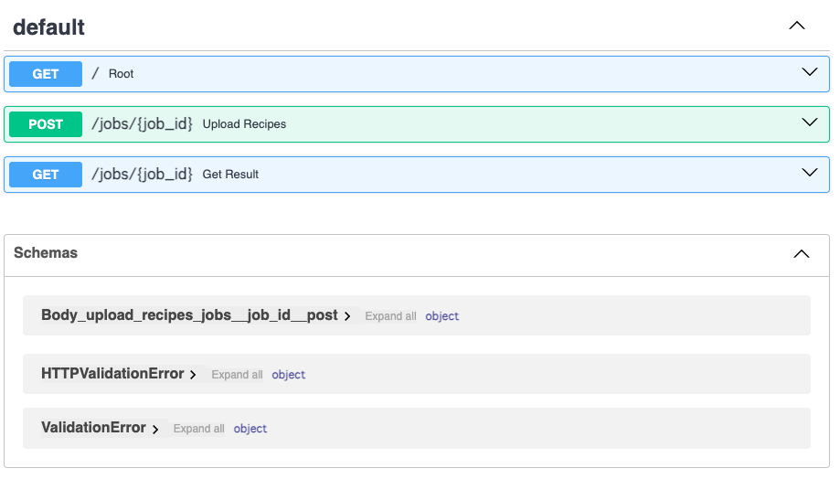
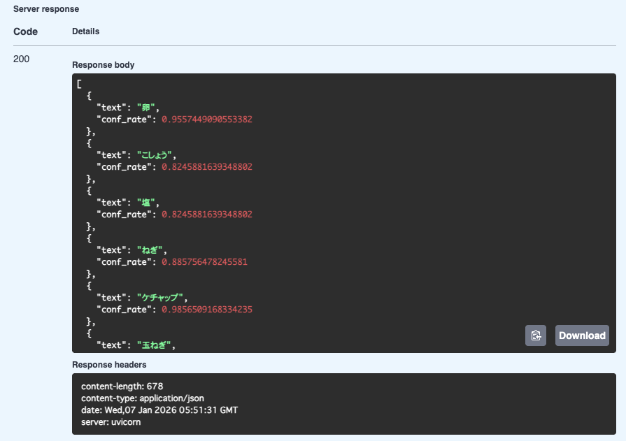

# Tegaki Recipe Server

A FastAPI based backend that extracts ingredients from handwritten recipe images.  
Designed as an MVP with a focus on clear API design, debuggability, and extensibility.

---

## Overview

- Upload one recipe with multiple images
- Extract ingredients using OCR
- Job based API to avoid request timeouts
- File based state management (no database for MVP)

---

## API Design


### Create Job
POST /jobs

- multipart form data
- recipe_name
- files (multiple images)

Response example

{
  "job_id": "uuid",
  "status": "pending"
}

---

### Get Job Status / Result
GET /jobs/{job_id}

#### While processing
Returns current job status.
{
  "job_id": "uuid",
  "status": "pending"
}

#### When finished
Once the status is "done", the API returns the list of extracted ingredients with thier confidence rates

```json
[
  {
    "text": "卵",
    "conf_rate": 0.9557449090553382
  },
  {
    "text": "こしょう",
    "conf_rate": 0.8245881639348802
  }
]
```

---

## Design Decisions

- Job based pattern  
  Long running OCR tasks are handled asynchronously to prevent timeouts.

- No database (MVP)  
  Job state is stored as JSON files for simplicity and easy debugging.

- Clear error handling  
  Expected states are handled with if statements.  
  Broken or unexpected states are handled with exceptions.

- Separation of concerns  
  Upload, OCR, and result retrieval are clearly separated.

---

## Job Storage Structure

uploads/  
  jobs/  
    {job_id}/  
      status.json  
      meta.json  
      images/  
      ingredients.json  

---

## Tech Stack

- Python
- FastAPI
- EasyOCR
- JSON file based state management

---

## Future Work

- Replace background tasks with Celery and Redis
- Ingredient normalization and quantity extraction
- Persistent recipe storage
